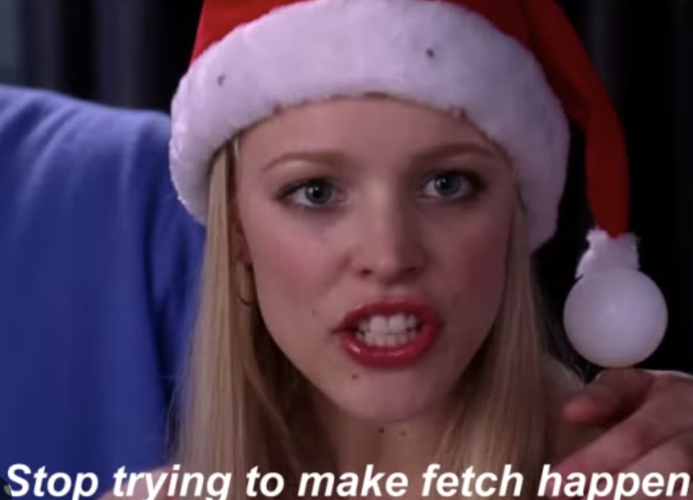

# Overview

I thought it would be funny to make a package that blocked fetch from happening.

               Is there a good reason? No.                                           
               
It's just a fun Mean Girls reference
